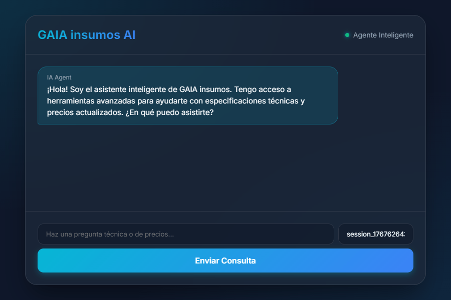
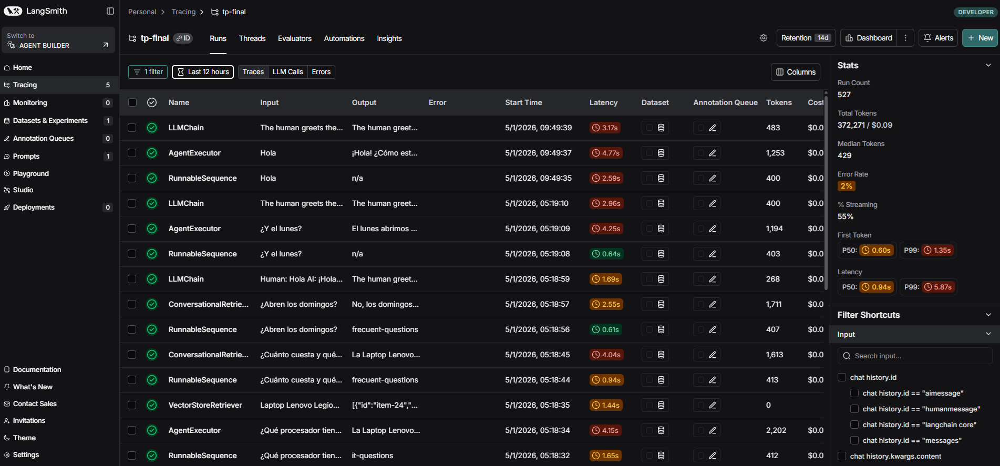

# GAIA insumos - Chatbot de Insumos de Informática

Este proyecto es un chatbot avanzado para **GAIA insumos**, una tienda de insumos de informática, construido con **Node.js**, **Express**, **LangChain** y **OpenAI** (modelo `gpt-4o-mini`). Incluye dos versiones que demuestran la evolución de un chatbot simple a un sistema más avanzado con memoria persistente y agentes inteligentes.

## 🎯 ¿Qué hace?

- **Responde preguntas sobre productos**: información, precios y características de componentes de PC, periféricos y laptops.
- **Atiende consultas frecuentes**: horarios, pagos, envíos y garantías.
- **Mantiene el contexto**: recuerda la conversación para responder preguntas de seguimiento (V2).
- **Enruta inteligentemente**: utiliza un agente evaluador para clasificar y dirigir las consultas a la fuente de datos correcta (V2).

## 🚀 Características

### ChatBot V1 - RAG Básico

- **Endpoint**: `POST /chat` | **Interfaz**: `/chatbot-v1.html`
- ✅ **RAG básico** con búsqueda semántica en ChromaDB.
- ✅ **50 productos** de informática predefinidos.
- ✅ **Sin memoria** (cada consulta es independiente).

### ChatBot V2 - Sistema de Agentes con Memoria y Herramientas (Trabajo Final)

- **Endpoint**: `POST /chatt` | **Interfaz**: `/chatbot-v2.html`
- ✅ **Memoria Persistente**: Mantiene el historial de conversación (guardado localmente en `conversation_memories`).
- ✅ **Sistema de Agentes Avanzado**:
    - 🤖 **QuestionEvaluator**: Clasifica la intención del usuario usando LLM.
    - 💻 **IT_Agent**: Agente principal potenciado por **Tools**.
    - ❓ **FrequentQuestionAgent**: Experto en información de la tienda.
- ✅ **Herramientas (Tools)**:
    - 🛠️ **it_product_search**: RAG como herramienta para buscar información de productos.
    - 🛠️ **get_product_price**: Herramienta personalizada para consultar precios exactos.
    - 🛠️ **get_current_time**: Integración simulada con un **MCP Server** de tiempo.
- ✅ **Tracking de Actividades**: Sistema de notificaciones en tiempo real que muestra al usuario qué agentes, tools y MCPs se están usando durante cada consulta.
- ✅ **Monitoreo**: Integración completa con **LangSmith** para trazas y debugging.
- ✅ **Dos colecciones ChromaDB**: una para productos y otra para información de la tienda.

## 🎬 Demo

A continuación se muestra una demostración completa del **ChatBot V2** en acción, mostrando una conversación real con un cliente:



**La demo ilustra las capacidades avanzadas del sistema:**
- ✅ **Búsqueda semántica de productos** mediante RAG (Retrieval-Augmented Generation)
- ✅ **Memoria contextual** que mantiene el hilo de la conversación
- ✅ **Uso inteligente de herramientas** (Tools) como `get_product_price` para obtener información precisa
- ✅ **Enrutamiento automático** entre agentes especializados (IT_Agent y FrequentQuestionAgent)
- ✅ **Razonamiento y cálculos** en tiempo real para responder consultas complejas
- ✅ **Manejo de información de la tienda** (horarios, medios de pago, políticas)

## 📂 Estructura del Proyecto

```
/
|-- conversation_memories/  # Almacena el historial de conversaciones para ChatBot V2
|-- public/                 # Archivos estáticos para la interfaz web
|   |-- chatbot-v1.html
|   |-- chatbot-v2.html
|   `-- style.css
|-- src/                    # Código fuente
|   |-- data/               # Archivos de datos (productos, información de la tienda)
|   |-- middleware/         # Middleware de Express (manejo de errores, validación)
|   |-- models/             # Modelos de datos y esquemas
|   |-- routes/             # Rutas de la API para los chatbots
|   |-- scripts/            # Scripts para poblar la base de datos
|   |-- services/           # Lógica central de la aplicación
|       |-- agents/         # Agentes de IA para ChatBot V2
|       `-- tools/          # Herramientas utilizadas por los agentes
|-- tests/                  # Tests de integración
|-- .env.example            # Plantilla de variables de entorno
|-- docker-compose.yml      # Configuración de Docker Compose
|-- Dockerfile              # Configuración de Docker para la aplicación
`-- package.json            # Dependencias y scripts del proyecto
```

## 📦 Dependencias Clave

- **Node.js**: Entorno de ejecución de JavaScript.
- **Express**: Framework web para Node.js.
- **LangChain**: Framework para desarrollar aplicaciones impulsadas por modelos de lenguaje.
- **OpenAI**: API para acceder a modelos de lenguaje grandes.
- **ChromaDB**: Base de datos vectorial para búsqueda semántica.
- **Docker**: Plataforma para desarrollar, enviar y ejecutar aplicaciones en contenedores.
- **Jest**: Framework de testing de JavaScript.

## 🛠️ Instalación y Ejecución

**Requisitos previos:**

- Docker y Docker Compose
- Node.js (para ejecución local)
- Git

**Pasos:**

1.  **Clonar el repositorio:**
    ```bash
    git clone <repository-url>
    cd ChatBot-API-JS
    ```

2.  **Configurar variables de entorno:**
    Crea un archivo llamado `.env` en la raíz del proyecto y agrega tu clave de API de OpenAI:
    ```env
    OPENAI_API_KEY="sk-..."
    ```

3.  **Elegir un método de ejecución:**

    ### Opción A: Usando Docker (Recomendada)
    Esta es la forma más fácil de comenzar, ya que no requiere instalar Node.js ni ChromaDB en tu máquina local.

    1.  **Construir e iniciar los contenedores:**
        ```bash
        docker-compose up --build
        ```
    2.  **Poblar la base de datos:**
        En una nueva terminal, ejecuta el siguiente comando para poblar la base de datos ChromaDB con la información de los productos:
        ```bash
        docker-compose run app npm run db:populate
        ```
    3.  **Acceder a la aplicación:**
        La aplicación estará disponible en `http://localhost:3001`.

    ### Opción B: Ejecución Local
    Esta opción requiere tener Node.js y Docker instalados en tu máquina local.

    1.  **Iniciar ChromaDB:**
        ```bash
        docker-compose up chroma -d
        ```
    2.  **Instalar dependencias:**
        ```bash
        npm install
        ```
    3.  **Configurar conexión a ChromaDB:**
        En tu archivo `.env`, agrega las siguientes líneas:
        ```env
        CHROMA_HOST=localhost
        CHROMA_PORT=8002  # Puerto expuesto por Docker (ChromaDB usa 8000 internamente)
        ```
    4.  **Poblar la base de datos:**
        ```bash
        npm run db:populate
        ```
    5.  **Iniciar la aplicación:**
        ```bash
        npm start
        ```
    6.  **Acceder a la aplicación:**
        La aplicación estará disponible en `http://localhost:3000`.

## 🖥️ Interfaces Web

### Con Docker
- **Página de Inicio**: [http://localhost:3001/](http://localhost:3001/) - Página principal para seleccionar entre las demos disponibles.
- **ChatBot V1 (Chat Básico)**: [http://localhost:3001/chatbot-v1.html](http://localhost:3001/chatbot-v1.html)
- **ChatBot V2 (IA Agent Avanzado)**: [http://localhost:3001/chatbot-v2.html](http://localhost:3001/chatbot-v2.html)

### Ejecución Local (sin Docker)
- **Página de Inicio**: [http://localhost:3000/](http://localhost:3000/)
- **ChatBot V1 (Chat Básico)**: [http://localhost:3000/chatbot-v1.html](http://localhost:3000/chatbot-v1.html)
- **ChatBot V2 (IA Agent Avanzado)**: [http://localhost:3000/chatbot-v2.html](http://localhost:3000/chatbot-v2.html)

> **Nota sobre Puertos**:
> - **Puerto interno de la aplicación**: 3000 (definido en `src/app.js`)
> - **Puerto expuesto con Docker**: 3001 (mapeado en `docker-compose.yml` como `3001:3000`)
> - **Puerto de ChromaDB con Docker**: 8002 externamente, 8000 internamente
>
> Si ejecutas la aplicación localmente sin Docker, usa el puerto 3000. Si usas Docker, accede por el puerto 3001.

## 🧪 Tests

### Ejecución Local

Para ejecutar los tests de integración localmente (requiere Node.js y ChromaDB corriendo):

```bash
npm test
```

### Ejecución con Docker

Para ejecutar los tests utilizando Docker (no requiere Node.js local):

```bash
docker-compose run app npm test
```

### Verificando el uso de Tools

Hemos agregado tests específicos para verificar que los agentes están utilizando las herramientas correctamente.

**Local:**
```bash
npm test tests/tools.test.js
```

**Docker:**
```bash
docker-compose run app npm test tests/tools.test.js
```

También puedes observar los logs en la consola del servidor. Cada vez que el agente decide usar una herramienta, verás un log como:
- `[TOOL USE] get_product_price called with: ...`
- `[TOOL USE] get_current_time called ...`
- `[TOOL USE] it_product_search called with: ...`

## 🔔 Sistema de Tracking de Actividades

El **ChatBot V2** incluye un sistema de tracking que informa al usuario sobre las operaciones internas que se ejecutan durante cada consulta. Cada vez que el chatbot utiliza un agente, una herramienta (tool) o un servicio MCP, se envía metadata al frontend que muestra notificaciones sutiles y animadas.


### Características del Tracking

- **🤖 Agentes**: Notifica cuando se activa un agente especializado (QuestionEvaluator, IT_Agent, FrequentQuestionAgent)
- **🔧 Tools**: Muestra qué herramientas se están usando (búsquedas vectoriales, consultas de precios)
- **🔌 MCPs**: Indica cuando se consultan servicios externos (Model Context Protocol)
- **⏱️ Tiempo Real**: Las notificaciones aparecen secuencialmente mientras se procesa la consulta
- **🎨 Diseño Moderno**: Animaciones sutiles con glassmorphism en la esquina inferior derecha

### Metadata Retornada

Cada respuesta del ChatBot V2 incluye metadata detallada:

```json
{
  "response": "El precio de la laptop gamer es $1200 USD.",
  "metadata": {
    "activities": [
      {
        "type": "agent",
        "name": "QuestionEvaluator",
        "description": "Evaluando tipo de pregunta...",
        "timestamp": "2024-01-05T20:00:00.000Z"
      },
      {
        "type": "tool",
        "name": "get_product_price",
        "description": "Consultando precio exacto de producto",
        "input": "laptop gamer",
        "timestamp": "2024-01-05T20:00:03.000Z"
      }
    ],
    "summary": {
      "total": 4,
      "agents": 2,
      "tools": 2,
      "mcps": 0
    },
    "requestId": "550e8400-e29b-41d4-a716-446655440000",
    "category": "it-questions"
  }
}
```

### Beneficios

- **Transparencia**: El usuario entiende qué está haciendo el chatbot en cada momento
- **Educación**: Aprende sobre la complejidad del sistema de agentes e IA
- **Confianza**: Ve de dónde proviene la información que recibe
- **Debug**: Facilita identificar y reportar problemas específicos

Para más detalles sobre la implementación, consulta la documentación completa en [`docs/ACTIVITY_TRACKING.md`](docs/ACTIVITY_TRACKING.md).

## 📊 Monitoreo con LangSmith

Este proyecto está integrado con **LangSmith**, una plataforma de observabilidad y debugging para aplicaciones de LangChain. LangSmith permite visualizar y analizar cada interacción del chatbot en tiempo real.



### ¿Qué es LangSmith?

**LangSmith** es una herramienta de desarrollo que proporciona:
- 🔍 **Trazabilidad completa**: Visualiza cada paso de la ejecución del agente
- 🐛 **Debugging avanzado**: Identifica problemas en las cadenas de razonamiento
- 📈 **Métricas de rendimiento**: Monitorea tiempos de respuesta y uso de tokens
- 🧪 **Testing y evaluación**: Compara diferentes versiones del prompt y configuraciones
- 📝 **Historial de conversaciones**: Almacena y revisa interacciones pasadas

### Configuración de LangSmith

Para habilitar LangSmith en tu proyecto, configura las siguientes variables de entorno en tu archivo [`.env`](.env.example):

```env
# LangSmith Configuration
LANGCHAIN_TRACING_V2=true                           # Habilita el trazado de LangChain
LANGCHAIN_ENDPOINT=https://api.smith.langchain.com  # Endpoint de la API de LangSmith
LANGCHAIN_API_KEY="lsv2_pt_..."                     # Tu clave API de LangSmith
LANGCHAIN_PROJECT=chatbot-api-js                    # Nombre del proyecto en LangSmith
```

**Pasos para obtener tu API Key:**

1. Crea una cuenta gratuita en [smith.langchain.com](https://smith.langchain.com)
2. Ve a **Settings** → **API Keys**
3. Crea una nueva API Key
4. Copia la key y agrégala a tu archivo `.env`

### Visualización de Trazas

Una vez configurado, cada interacción con el chatbot generará una traza en LangSmith que muestra:
- La consulta del usuario
- El razonamiento del agente evaluador
- Las herramientas utilizadas y sus resultados
- La respuesta final generada
- Tiempos de ejecución y consumo de tokens

Accede al dashboard de LangSmith en [https://smith.langchain.com](https://smith.langchain.com) para ver las trazas en tiempo real.

> **Nota**: LangSmith es opcional. El chatbot funcionará perfectamente sin estas configuraciones, simplemente no tendrás visibilidad de las trazas de ejecución.

## 🔧 Solución de Problemas

- **Error: `Error: connect ECONNREFUSED 127.0.0.1:8002`**: Este error indica que el contenedor de ChromaDB no se está ejecutando o no es accesible. Asegúrate de haber iniciado el contenedor de ChromaDB usando `docker-compose up chroma -d` antes de ejecutar la aplicación localmente.
- **Error: `OPENAI_API_KEY not set`**: Este error significa que falta la clave de API de OpenAI. Asegúrate de haber creado un archivo `.env` en el directorio `ChatBot-API-JS` y haber agregado tu clave de API de OpenAI en él.
- **Tiempos de respuesta lentos**: El chatbot V2 a veces puede tardar en responder, especialmente en la primera consulta. Esto se debe a que el modelo de lenguaje necesita cargarse y el agente necesita decidir qué herramienta usar. Las consultas posteriores deberían ser más rápidas.
